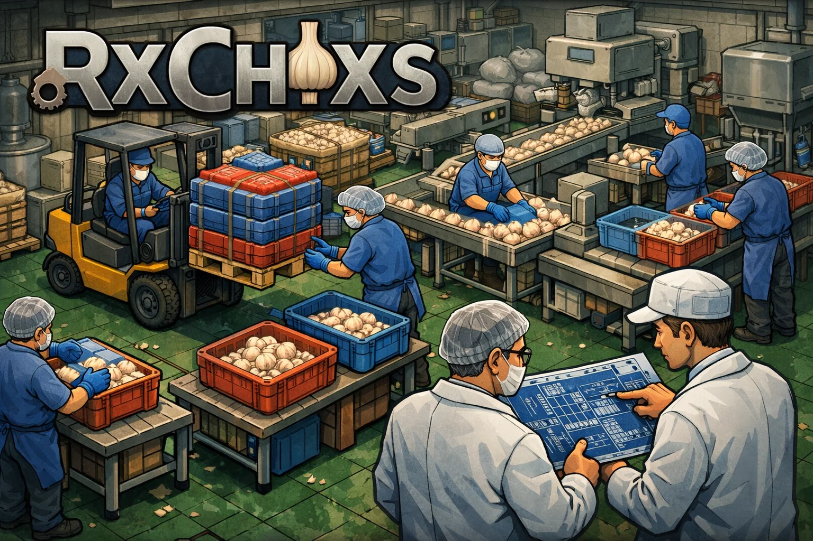

<p align="center">
  
</p>

<h1 align="center">Rxchixs</h1>

<p align="center">
  Un factory sim 2D top-down ou l'usine tourne deja sans vous, et ou chaque decision du joueur se lit dans les flux, les KPI et l'argent.
</p>

<p align="center">
  
  
  
  
  
</p>

## Le pitch

Rxchixs est un jeu de gestion industrielle vu de dessus, sur grille, pense comme une usine-aquarium. La production continue d'exister, d'avancer et de se deregler toute seule. Le role du joueur n'est pas de cliquer pour faire produire, mais d'observer, comprendre, corriger et redessiner le systeme.

Le coeur de la promesse tient en une idee simple : toute action du joueur doit produire un effet lisible sur les flux, les KPI puis la tresorerie. On ne cherche pas seulement a poser des machines. On cherche a faire vivre un ecosysteme industriel, humain et economique qui reste comprehensible.

> Le jeu demarre avec une usine deja fonctionnelle et rentable, puis laisse le joueur tout reconstruire pour gagner en debit, en fiabilite et en marge.

## Pourquoi le concept est fort

| Pilier | Promesse de design | Ce que ca change pour le joueur |
| --- | --- | --- |
| Usine vivante | La simulation tourne sans attendre le joueur. | On observe un systeme reel, pas un puzzle fige. |
| Starter factory jouable | La partie commence avec une ligne deja rentable. | On optimise d'abord, puis on reinvente ensuite. |
| Lecture economique claire | Chaque mecanique doit remonter jusqu'aux KPI et a l'argent. | Les decisions ont des consequences visibles et mesurables. |
| Architecture data-driven | Layouts, configs, zones et contenus doivent rester pilotes par les donnees. | Le projet reste extensible sans durcir le gameplay. |

## Boucle de jeu

1. Observer l'usine, les congestions, les temps morts, les erreurs et les couts caches.
2. Modifier le layout, les zones, les machines, les flux logistiques et les priorites.
3. Mesurer l'effet sur le debit, les rebuts, la disponibilite machine, le service et la rentabilite.
4. Reinvestir pour absorber de nouveaux goulots et faire evoluer l'usine vers une meilleure stabilite.

## Ce que vise Rxchixs

- Donner la sensation de gerer une vraie ligne de production plutot qu'un simple tapis roulant abstrait.
- Melanger optimisation industrielle, lisibilite economique et couche humaine auditable.
- Rendre le "pourquoi ca marche" aussi interessant que le "quoi construire".
- Garder une structure suffisamment generique pour accueillir d'autres productions que la ligne de depart.

## Starter factory : la ligne de depart

Le dataset initial s'appuie sur une ligne de transformation d'ail deja en place. Elle sert de socle jouable pour la simulation et de demonstrateur du framework :

1. reception et stockage des lots,
2. sechage / soufflerie,
3. cassage et separation,
4. lavage, decoupe et deshydratation,
5. tri qualite,
6. conditionnement et stockage,
7. vente des produits finis.

Cette ligne n'est pas une contrainte de design a long terme. Elle est volontairement utilisee comme premier cas concret pour construire un systeme generisable, pilote par les donnees.

## Ce que le prototype contient deja

- Une simulation a tick fixe avec separation nette entre simulation et rendu.
- Une starter factory chargee depuis des fichiers RON et des parametres de simulation serialises.
- Une boucle economique avec tresorerie, revenus, couts et KPI de production.
- Des blocs de ligne, zones logiques, outils de construction et peinture de sols/zones.
- Un editeur de carte avec sauvegarde, chargement, autosave, duplication de layout et export blueprint.
- Un systeme de sauvegardes versionnees, compatible avec l'evolution du schema.
- Une base de tests unitaires couvrant deja la simulation, l'edition et une partie de l'UI.

## Vision produit

A terme, Rxchixs doit ressembler a un sandbox industriel vivant dans lequel :

- les machines ont un etat, un cout et des contraintes operationnelles,
- les humains ont des besoins, des limites et des impacts sur la performance,
- les jobs, reservations et priorites restent debogables,
- les zones servent autant a organiser la production qu'a piloter les risques et les KPI,
- le joueur lit les problemes a travers les symptomes du systeme, pas via des scripts caches.

## Architecture technique

- Langage : Rust stable
- Rendu et input : `macroquad`
- Serialisation : `serde` + `ron`
- Donnees : cartes, layouts, blueprints et configurations charges depuis des fichiers
- Simulation : tick fixe explicite, independante du framerate
- Conception : separation simulation / rendu, approche data-driven et tests deterministes

## Demarrage rapide

Pre-requis : Rust stable installe localement.

```bash
cargo run
```

Commandes utiles :

- `cargo fmt`
- `cargo clippy --all-targets --all-features -- -D warnings`
- `cargo test`

## Documentation

- [Concept du jeu](docs/CONCEPT_JEU.md)
- [Plans de chantier](docs/PLANS.md)
- [Instructions agent/projet](AGENTS.MD)

## Feuille de route

- Consolider la simulation usine et la causalite KPI -> finances.
- Renforcer les systemes humains, les jobs et les reservations de facon auditable.
- Etendre la qualite du build mode, des overlays et de l'observabilite.
- Garder l'usine de depart rentable, lisible et agreable a optimiser.

## Contribution

Pour contribuer proprement :

- respecter la separation simulation / rendu,
- eviter le hardcode de contenu quand une donnee peut etre externalisee,
- preserver le caractere jouable de l'usine de depart,
- ajouter des tests des qu'une logique pure evolue,
- privilegier la lisibilite des causes metier, surtout sur la simulation, l'economie et l'IA.

## Statut

Le projet est en phase prototype, avec une ambition de structure solide des maintenant. L'objectif est d'iterer vite sur un jeu qui reste techniquement propre, extensible et credible cote simulation.
